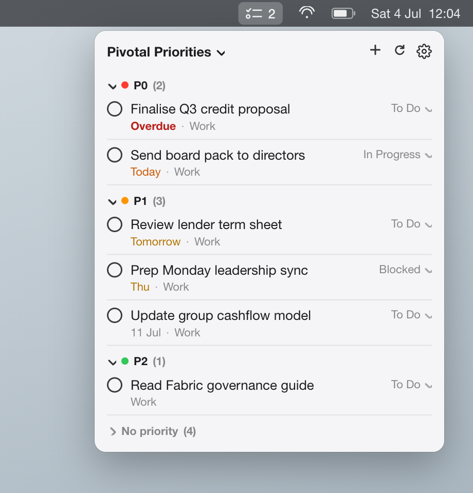
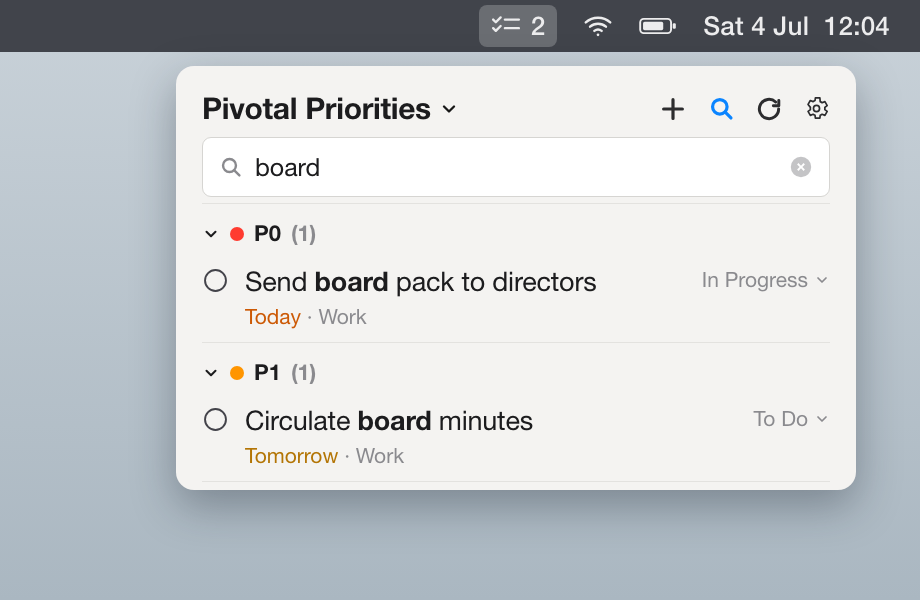
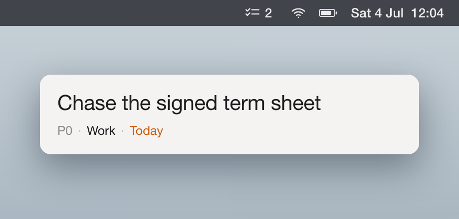
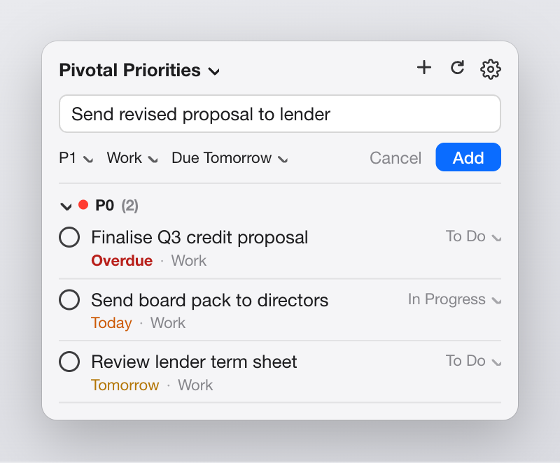
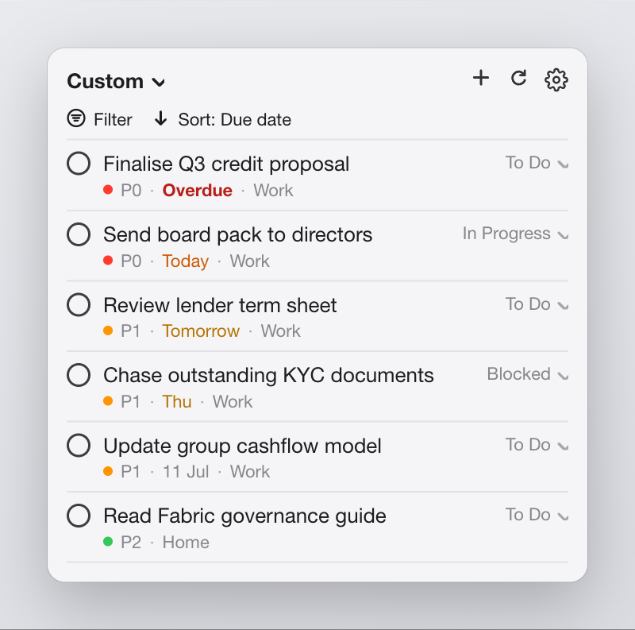
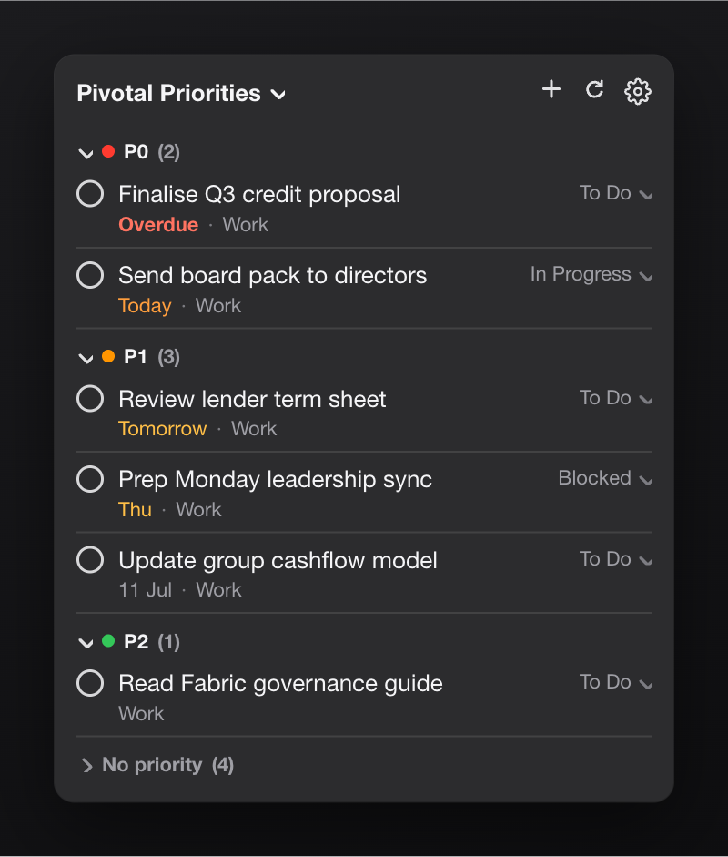
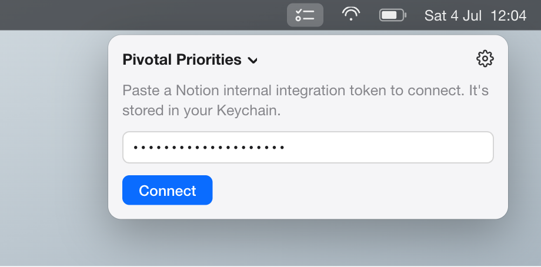

# Notion Tasks (macOS menu bar)

A native SwiftUI menu bar app that shows tasks from a Notion database and (in
later slices) lets you filter, sort and change their status. See the PRD in
GitHub issue #1 and the API decisions in `docs/adr/0001-notion-api-access.md`.

## Screenshots

Notion Tasks lives in the macOS menu bar as a checklist icon with a count of
tasks that are late or due today. Click it to drop the task panel:

<p align="center">
  
</p>

<table>
  <tr>
    <td colspan="2" align="center">
      
      <br><b>Search</b> — click the magnifier by the + to filter the current view by title as you type; grouped views keep their headers, and a fruitless search offers one tap to widen to all open tasks.
    </td>
  </tr>
  <tr>
    <td colspan="2" align="center">
      
      <br><b>Quick-capture</b> — press <kbd>⌥Space</kbd> from any app to drop a Spotlight-style capsule and add a task without opening the panel; Enter files it and the window vanishes. The shortcut is configurable from the gear menu.
    </td>
  </tr>
  <tr>
    <td width="50%" valign="top">
      
      <br><b>Quick-add</b> — capture a task inline with Priority, Category and a due date, without leaving the panel.
    </td>
    <td width="50%" valign="top">
      
      <br><b>Custom view</b> — build your own filter and sort; each row carries its priority dot.
    </td>
  </tr>
  <tr>
    <td width="50%" valign="top">
      
      <br><b>Dark mode</b> — the urgency tints adapt to a dark background (ADR-0003).
    </td>
    <td width="50%" valign="top">
      
      <br><b>First run</b> — paste a Notion integration token; it's stored in your Keychain.
    </td>
  </tr>
</table>

<sub>Interface mockups with sample data — the layout, colours and wording are taken from the app; the tasks shown are illustrative.</sub>

## Layout

- `Sources/NotionTasksCore` - all testable logic: the task model + decoder, the
  `URLSession`-backed `NotionClient` (behind an `HTTPClient` seam), the
  `KeychainTokenStore` (behind a `TokenStore` seam), and the `AppModel` that
  wires them together.
- `Sources/NotionTasksApp` - the SwiftUI `MenuBarExtra` shell. Thin; renders
  `AppModel.state`.
- `Tests/NotionTasksChecks` - the check suite (see below).

## Build and run

```sh
swift build                 # compile everything
./scripts/make-app.sh       # assemble a launchable NotionTasks.app
open NotionTasks.app        # a checklist icon appears in the menu bar (no Dock icon)
```

On first run the panel asks for a Notion internal integration token; it's saved
to the Keychain and reused after that. Create the token at
<https://www.notion.so/my-integrations>, then share the Tasks database with it
(database `...` menu -> Connections).

## Tests

This repo's machine has only the Command Line Tools, which ship neither XCTest
nor the Swift Testing macro plugin - so `swift test` cannot run. The checks are
therefore a small dependency-free executable:

```sh
swift run NotionTasksChecks
```

Each check reads like a spec and ports 1:1 to XCTest / Swift Testing if a full
Xcode is installed later. The two test seams are the `HTTPClient` transport
(stubbed) and the `TokenStore` (in-memory fake).

## Test fixtures

`Tests/NotionTasksChecks/Fixtures/query_response.json` is the decode fixture.
See its README for provenance and how to re-capture it from the live database.
